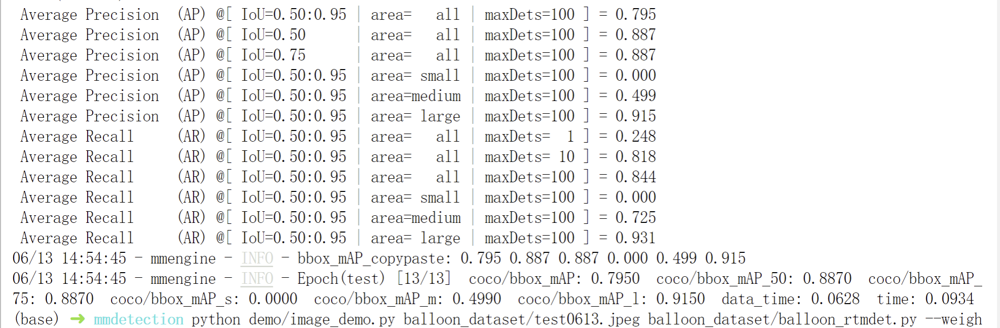

# OpenMMLab 实战营第三次作业
## 文件说明
 - [配置文件](config/balloon_rtmdet.py)
 - [训练日志](work_dirs/20230612_001212/20230612_001212.log)
 - [验证集评估日志](work_dirs/resnet50_fruit30/20230612_001926/20230612_001926.log)

## 验证集指标
 

## 预测图片

